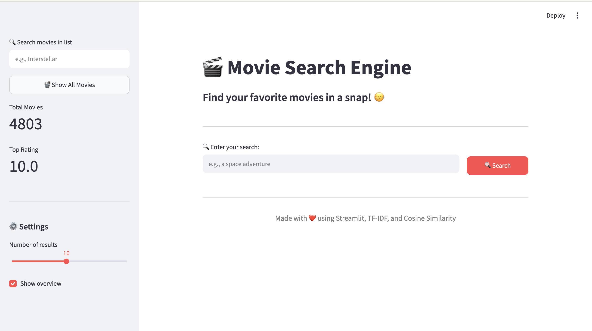
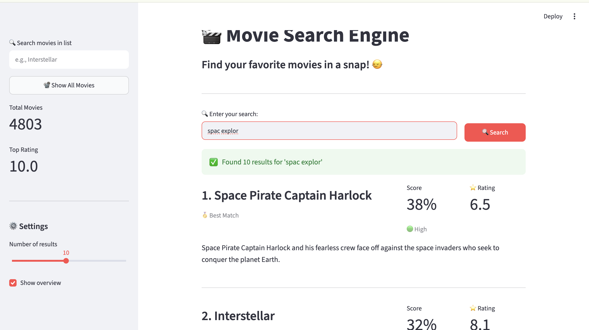
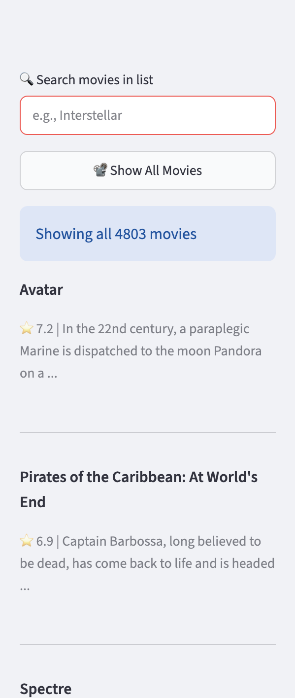

# 🎬 Movie Search Engine

An intelligent movie search engine built with **Python** and **Streamlit** that retrieves relevant movies using **TF-IDF** and **Cosine Similarity**. Search through a dataset of **5,000 movies** from **TMDb** with smart text preprocessing and optional automatic spelling correction.


---

# Features

-  **Semantic Search** using TF-IDF vectorization and Cosine Similarity
-  **Text Preprocessing**
  - Punctuation removal
  - Stopword filtering
  - Porter Stemming
-  **Optional Automatic Spelling Correction** (via `pyspellchecker`)
-  **Interactive Streamlit UI**
-  **Ranked Results** sorted by relevance score
-  **Sidebar Filters** for browsing and searching movies
-  **Persistent Index** cached for faster startup

---
## Screenshots

### Home Page



### Search Results



## show all movie in sidebar



<p align="center">
  
  
  
</p>

---
# Quick Start

## Prerequisites

- Python 3.8+
- pip

## Installation

### 1. Clone the repository

```bash
git clone https://github.com/NiloofarSM/movie-search-engine.git
cd movie-search-engine
```

### 2. Create and activate a virtual environment (recommended)

**macOS / Linux**

```bash
python -m venv venv
source venv/bin/activate
```

**Windows**

```bash
python -m venv venv
venv\Scripts\activate
```

### 3. Install dependencies

```bash
pip install -r requirements.txt
```

### 4. Download the dataset

Download **TMDB 5000 Movie Metadata** from Kaggle:

https://www.kaggle.com/datasets/tmdb/tmdb-movie-metadata

Place the file

```text
tmdb_5000_movies.csv
```

inside the **Data/** folder.

---

# Running the Application

## Streamlit Web Interface (Recommended)

```bash
streamlit run src/app.py
```

## Command-Line Interface (CLI)

```bash
python main.py
```

---

# Project Structure

```text
movie-search-engine/
├── Data/
│   └── tmdb_5000_movies.csv
├── src/
│   ├── __init__.py
│   ├── app.py
│   ├── data_utils.py
│   ├── indexer.py
│   ├── preprocess.py
│   └── search.py
├── index/
│   ├── documents.pkl
│   ├── tfidf_matrix.pkl
│   └── vectorizer.pkl
├── main.py
├── requirements.txt
├── README.md
└── .gitignore
```

---

# How It Works

## 1. Text Preprocessing

- Lowercasing
- Punctuation removal
- Stopword filtering (NLTK)
- Porter Stemming

## 2. Index Building

- TF-IDF vectorization
- Document-term matrix creation
- Cached vectorizer and index for faster reuse

## 3. Search

- The query is preprocessed using the same pipeline
- Cosine similarity is computed against all movie vectors
- Movies are ranked by relevance score
- The most relevant results are returned

## 4. Spell Checking (Optional)

If **pyspellchecker** is installed, misspelled queries are automatically corrected before searching.

---

# Dependencies

```text
streamlit>=1.28.0
pandas>=2.0.0
scikit-learn>=1.3.0
nltk>=3.8.1
numpy>=1.24.0
pyspellchecker>=0.7.0
```

Install all dependencies with:

```bash
pip install -r requirements.txt
```

---

# Future Improvements

- Query expansion
- Phrase searching
- BM25 ranking
- Semantic search using Sentence Transformers
- Advanced filtering by genre, release year, and rating
- Personalized movie recommendations

---

<div align="center">

Made with ❤️ using Python & Streamlit

</div>